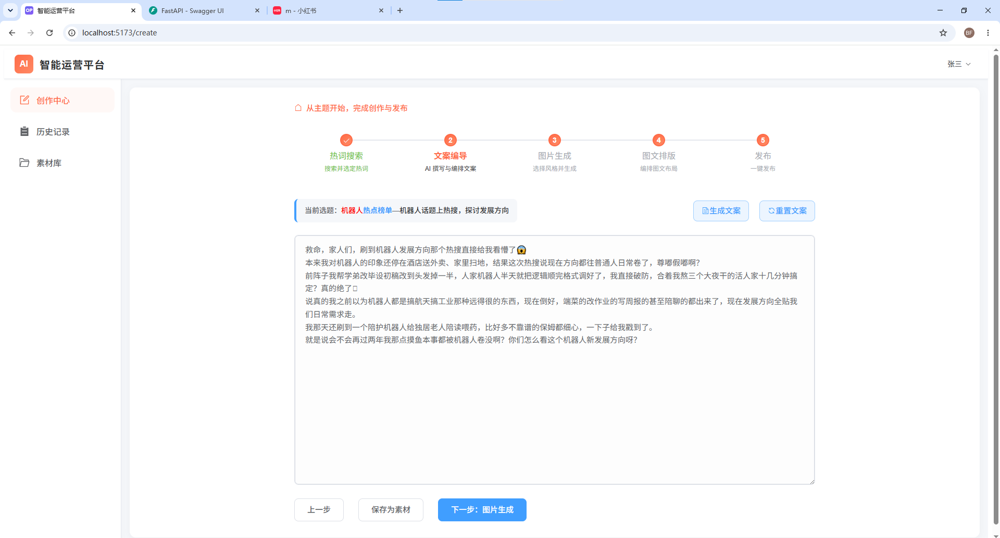
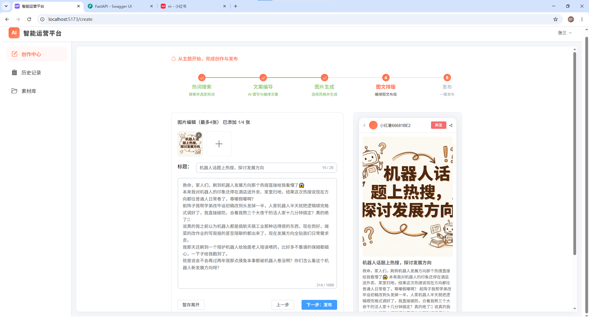
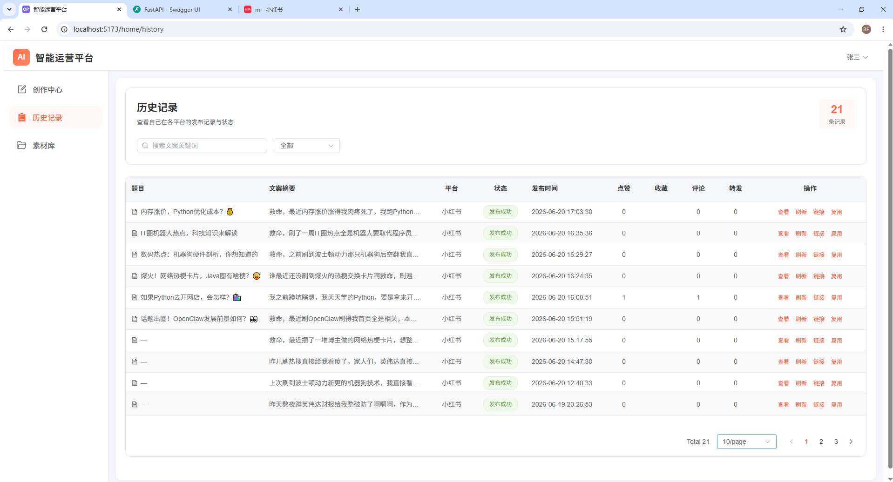
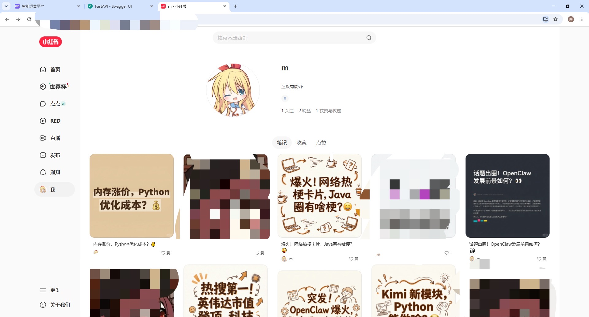

<div align="center">

# 🧰 AI 应用项目集合

多场景 AI 应用落地实践 —— 内容运营自动化 · RAG 智能问答


</div>

---

## 📖 目录

| 项目 | 目录 | 说明 |
| :--- | :--- | :--- |
| 🚀 **AI 智能运营平台** | [`operation/`](operation/) | 内容运营全链路自动化：选题 → 文案 → 配图 → 排版 → 发布 |
| 🛒 **电商智能客服系统** | [`RAG-ecommerce-qa/`](RAG-ecommerce-qa/) | 基于 RAG 的电商问答系统（DeepSeek + BGE + ChromaDB） |

---

# 🚀 一、AI 智能运营平台

## 1.1 项目简介

面向**内容运营**场景的一站式自动化生产平台，聚焦小红书生态。它把运营人员原本碎片化的工作流——找选题、写文案、做配图、排版、发布——收敛为一条可视化的五步流水线，每一步都由 AI 辅助完成，最后一步直达平台发布。

**核心思路**：把「一个人一天只能产出一篇」的内容生产，压缩成「一条流水线批量产出」。

**技术形态**：`operation/` 后端 FastAPI + `operation/operation_ui/` 前端 Vue3 + Vite（开发端口 5173）。

## 1.2 五阶段工作流

| 阶段 | 名称 | 说明 |
| :---: | :--- | :--- |
| 1️⃣ | 🔍 **热词搜索** | 搜索并选定当日热点话题，作为内容选题的起点 |
| 2️⃣ | ✍️ **文案编写** | AI 撰写与人工编辑结合，确定标题与正文表达 |
| 3️⃣ | 🎨 **图片生成** | 选择风格并生成配图，最多支持 4 张 |
| 4️⃣ | 🖼️ **图文排版** | 在模板中编辑图文组合，所见即所得 |
| 5️⃣ | 🚀 **发布** | 一键发布到平台，完成闭环 |

## 1.3 核心功能

- **向导式创作中心**：顶部进度条贯穿五个阶段，任一阶段均可回溯修改，支持「保存为素材」沉淀中间产物。
- **AI 文案引擎**：基于选定热词一键生成符合平台调性的口语文案，生成后仍可自由编辑。
- **实时预览的图文编辑器**：左侧编辑标题、正文与配图，右侧手机模型实时渲染最终效果，做到所见即所得。
- **发布历史与数据看板**：集中查看各平台的发布状态、发布时间与互动数据（点赞 / 收藏 / 评论 / 转发），支持关键词检索、状态筛选与分页。
- **一键复用**：历史内容支持「复用」，把已验证有效的选题与结构快速复制到新一轮生产。

## 1.4 界面演示

### ① 创建流程 · 文案生成



*创作中心顶部以五步进度条串起「热词搜索 → 文案编写 → 图片生成 → 图文排版 → 发布」。当前处于文案编写阶段，展示由热点话题生成的完整口语文案，并提供「生成文案 / 重置文案」与「保存为素材」操作。*

### ② 图文排版 · 实时预览



*图文排版阶段：左侧管理配图（最多 4 张，已添加 1/4）、编辑标题与正文并显示字数统计；右侧以手机模型实时预览小红书笔记的最终呈现效果，确认后即可「下一步：发布」。*

### ③ 发布历史与数据看板



*历史记录页汇总 21 条内容，表格列出题目、文案摘要、发布平台、状态、发布时间与点赞 / 收藏 / 评论 / 转发四项互动数据，支持关键词搜索、状态筛选、分页浏览与「查看 / 删除 / 复用」操作。*

### ④ 发布结果



*流水线产出的实际落地效果：平台账号主页已展示多篇由系统生成并发布的图文笔记（含封面与标题），验证了从选题到发布的端到端闭环真实可用。*

---

# 🛒 二、电商智能客服系统

基于 **RAG（检索增强生成）** 的电商智能客服问答系统，使用 DeepSeek 大模型 + BGE 向量化 + ChromaDB 向量数据库，支持 PDF / DOCX / TXT 文档上传、9 大类问题自动分类与推荐问题。

**技术栈**：FastAPI · BAAI/bge-small-zh-v1.5 · ChromaDB · DeepSeek API · 原生 HTML/CSS/JS

详细说明见 👉 [`RAG-ecommerce-qa/README.md`](RAG-ecommerce-qa/README.md)

---

## 📁 仓库结构

```
ai-projects/
├── operation/                       # AI 智能运营平台
│   ├── app/                         #   后端（FastAPI）
│   ├── operation_ui/                #   前端（Vue3 + Vite）
│   │   ├── public/                  #   静态资源（favicon.svg）
│   │   └── src/
│   └── main.py
├── RAG-ecommerce-qa/                # 电商智能客服系统
│   ├── src/  scripts/  static/  docs/
│   └── README.md
└── docs/
    └── screenshots/ops/             # 界面演示截图（本 README 引用）
```
